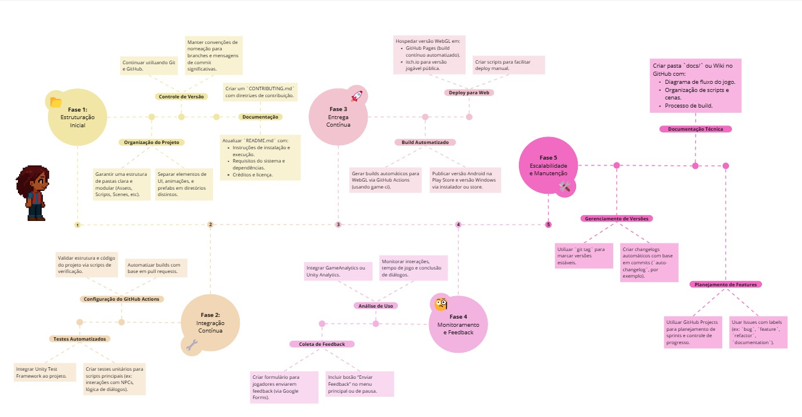

# Roadmap

## Histórico de versão

|Data|Versão|Descrição|Autores|
|--|--|--|--|
|21/04/2025|1.0|Adicionando versão inicial do roadmap de proposta de contribuição |[Júlio Cesar](https://github.com/Julio1099), [Maciel Júnior](https://github.com/macieljuniormax)|
|24/04/2025|1.1|Atualizando roadmap de proposta de contribuição |[Júlio Cesar](https://github.com/Julio1099), [Maciel Júnior](https://github.com/macieljuniormax)|

## Roadmap de Proposta de Contribuição

Este roadmap propõe ações estratégicas para contribuir com o desenvolvimento contínuo e sustentável do projeto Jogo-Unity-BOSS. A proposta está dividida em 5 fases principais, visando desde a estruturação até o monitoramento do projeto.

A imagem a seguir apresenta uma visão geral das etapas estratégicas sugeridas. Em seguida, o quadro interativo disponível no Miro possibilita uma exploração mais detalhada das fases propostas, permitindo uma análise abrangente dos aspectos relacionados à estruturação, automação, manutenção e organização colaborativa do desenvolvimento.

<iframe width="768" height="432" src="https://miro.com/app/embed/uXjVIAWc6To=/?pres=1&frameId=3458764625498556206&embedId=876067699118" frameborder="0" scrolling="no" allow="fullscreen; clipboard-read; clipboard-write" allowfullscreen></iframe>