# Criando seu primeiro nível

## Adquirindo assets
Para esse tutorial, partiremos de um [projeto Unity](https://github.com/Duerno/unity-for-women-at-unb) que possui uma coleção de sprites prontos.

1. Baixe o repositório e extraia o arquivo .zip

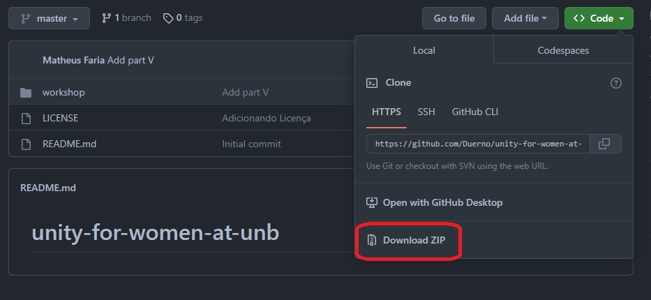

2. Em seguida, no Unity Hub, na aba Projects, clique em add/open e selecione a pasta “workshop” dentro da pasta do repositório baixado

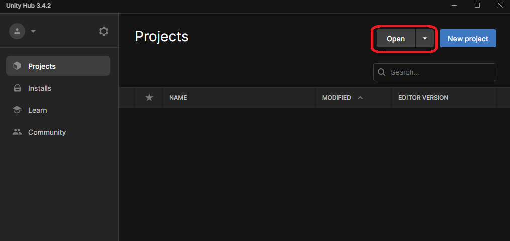

3. Selecione a versão 2019.4.9f1 LTS ou a versão mais próxima disponível
4. Abra o projeto

## Primeiros passos no projeto

⚠Projeto tem que ter aberto em uma tela vazia

### Alteração de um objeto numa cena

- Cena engloba tudo que está renderizado(ativo) no unity
- A alteração de um objeto pode ser feito dentro da cena ou na aba inspector 
- Algumas propriedades devem ser feitas na aba inspector  

Algumas alterações são:
1. Scale: Tamanho e proporções do objeto

2. Rotation: Rotação do objeto nos eixos x,y,z

3. Position: Posição do objeto na cena

4. Scene rotation: Rotação da Cena (a sua perspectiva como desenvolvedor)

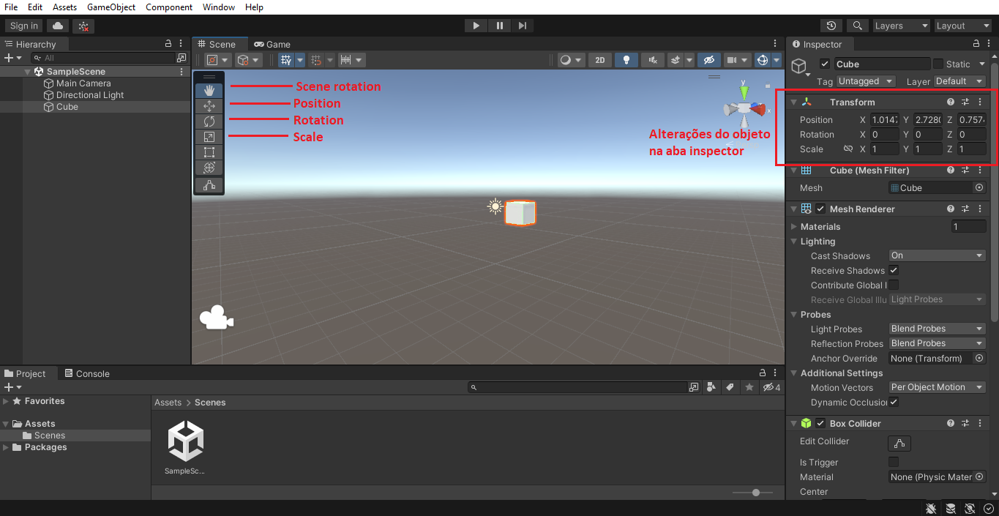

## Criação do nível

1. Clicando no objeto Câmera, garanta que está em modo orthographic e que os objetos que você criar a seguir estão dentro do campo de visão dela, é recomendado também trocar a perspectiva de edição para modo 2D

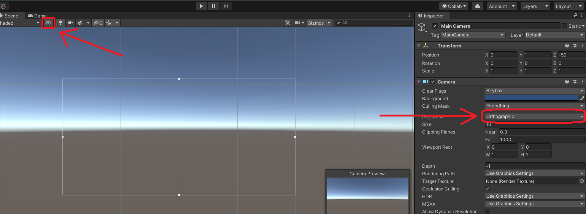

2. Na aba project na parte inferior da tela, navegue até Assets > Part I > Scenes
   - Você verá uma cena chamada “Part I”, apague ela e crie uma nova (botão direito > Create > Scene) com o nome que desejar, em seguida abra-a

   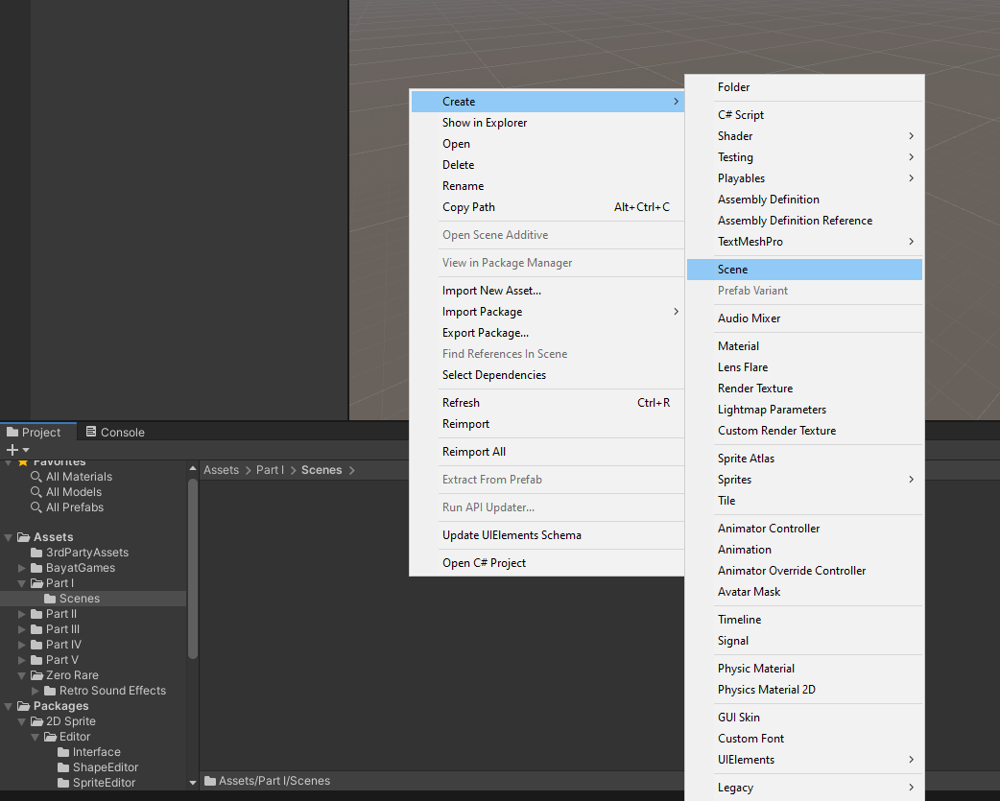
  
3. Na aba Hierarchy, crie um objeto vazio (Create Empty)

4. Com o novo objeto selecionado, adicione o componente sprite renderer

5. Abra o explorador de sprites e selecione um sprite de chão

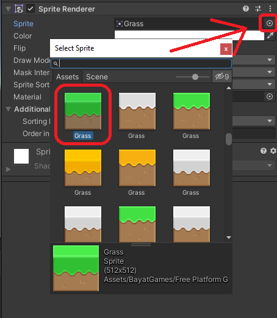

6. Para expandir o chão, crie cópias do objeto e alinha as cópias lado a lado
   - Segurar Ctrl pode facilitar o alinhamento

   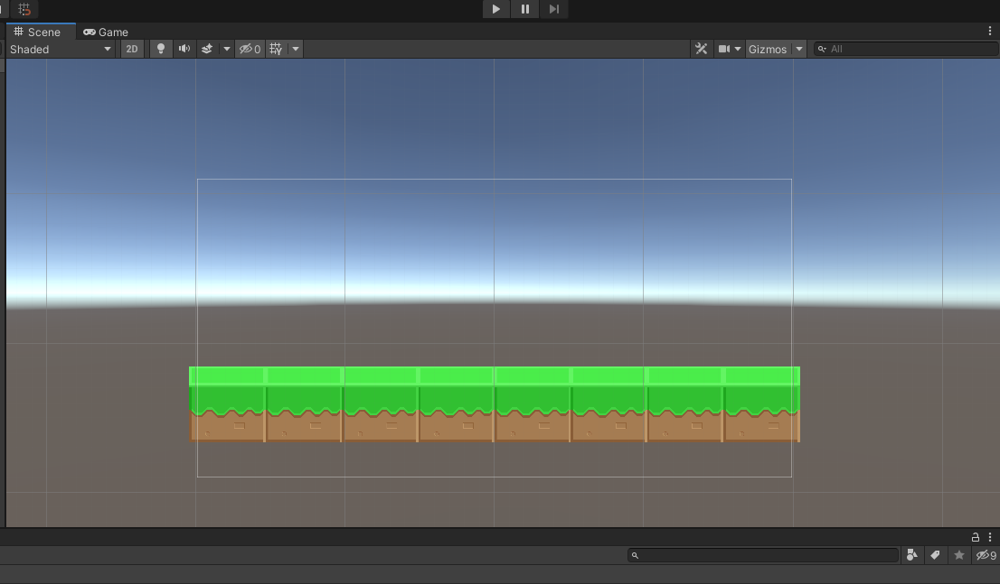

7. Para organização, crie um objeto vazio que guardará todos os chãos, e os insira dentro desse objeto

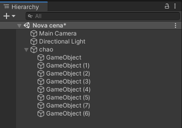

8. Adicione a parte subterrânea do chão para preencher a tela, da mesma forma como anteriormente

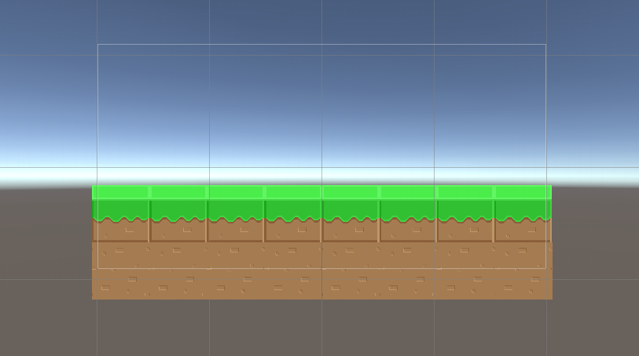

9. Crie um novo sprite renderer para o background e adicione um sprite como feito anteriormente

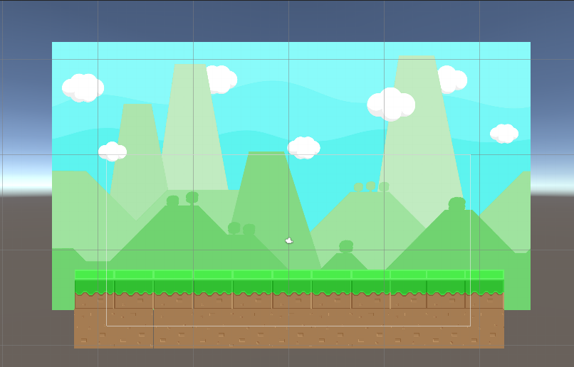

10. Por fim, crie mais um sprite para representar o personagem principal, daremos movimento à ele no proximo tutorial

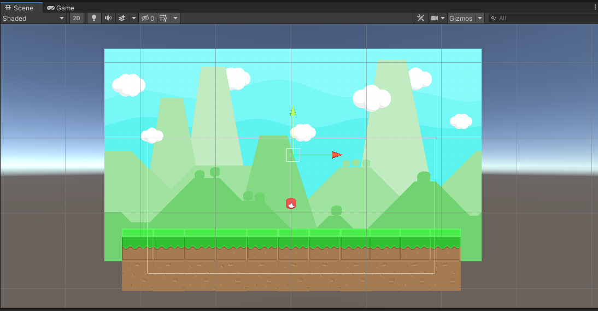

⚠ Certifique-se de posicionar o background atrás do seu chão e do player (valor da posição em Z superior) pois, caso esteja na frente, a visão do nível sera obscurecida e, caso esteja no mesmo valor em Z, pode ocorrer um fenômeno visual chamado Z-fighting ou Stitching

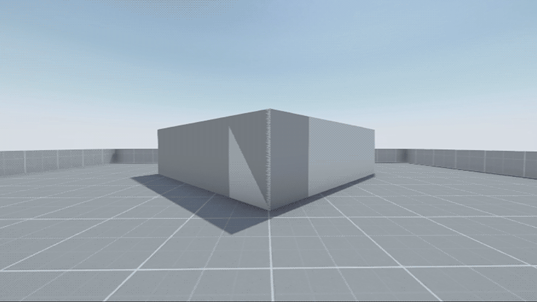
